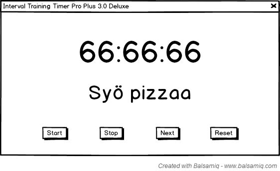
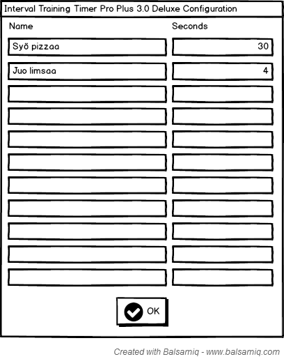

# Ajastinohjelma intervalliharjoitteluun

## Toiminnallisuudet korkealla tasolla

* Max. 10 erillistä countdown-ajastinta
* Ajastimet vuorottelee

## Use caset

* Käyttäjänä haluan, että ohjelmalla on graafinen käyttöliittymä
  * Syynä komentoriviallergia
* Käyttäjänä haluan pystyä asettamaan ajastimien aloitusluvut
  * Huom: Erilliset aloitusluvut
* Käyttäjänä haluan pystyä asettamaan ajastimille nimet
  * Esim: "Syö pizzaa", "Juo kolaa"
* Käyttäjänä haluan käynnistää ja pysäyttää ajastuksen
* Käyttäjänä haluan nähdä nykyisen ajastimen nimen ja jäljelläolevan ajan
  * Haluan nähdä luvut muodossa "HH:MM:SS", ei "SS"
* Käyttäjänä haluan vaihtaa mitä ajastinta lasketaan
* Käyttäjänä haluan aloittaa ajastuksen alusta
* Käyttäjänä haluan saada huomautuksen kun ajastin laskee loppuun
* Käyttäjänä haluan, että ajastimen päätyttyä aletaan ajastaa
  seuraavaa ajastinta
* Käyttäjänä haluan, että viimeisen ajastimen päätyttyä
  * saan erilaisen huomautuksen
  * ajastus alkaa alusta ensimmäisestä ajastimesta

## Tietorakenteet

### Ajastinluokka (`Timer`)

* `name` -- nimi, näytetään käyttäjälle
* `total_time` -- määritetty sekuntimäärä
* `elapsed_time` -- kulutettu sekuntimäärä
* `get_time_left()` -- jäljelläoleva sekuntimäärä

### Ajastinlistaluokka (`TimerList`)

* `timers` -- lista ajastimia (`Timer`-instansseja)
* `current_timer_index` -- nykyisen ajastimen indeksi (`0`..`len(timers)`)
* `get_current_timer()`
* `select_next_timer()`

## Käyttöliittymä

### Ajastinikkuna

### Konfiguraatioikkuna

